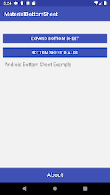
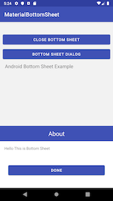

# MaterialBottomSheet

See the tutorial 

 * [https://tutorial.eyehunts.com/android/android-bottom-sheet-tutorial-example-kotlin/](https://tutorial.eyehunts.com/android/android-bottom-sheet-tutorial-example-kotlin/)

